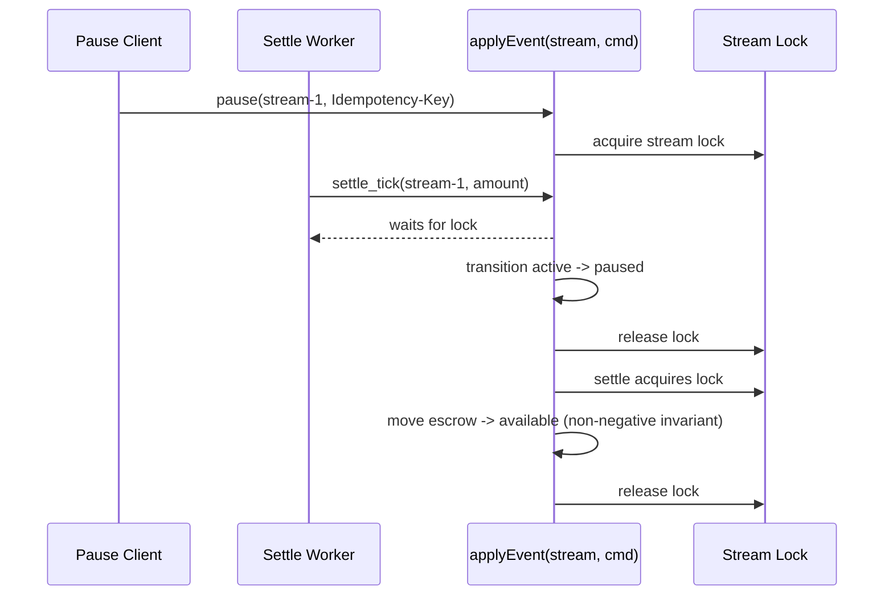
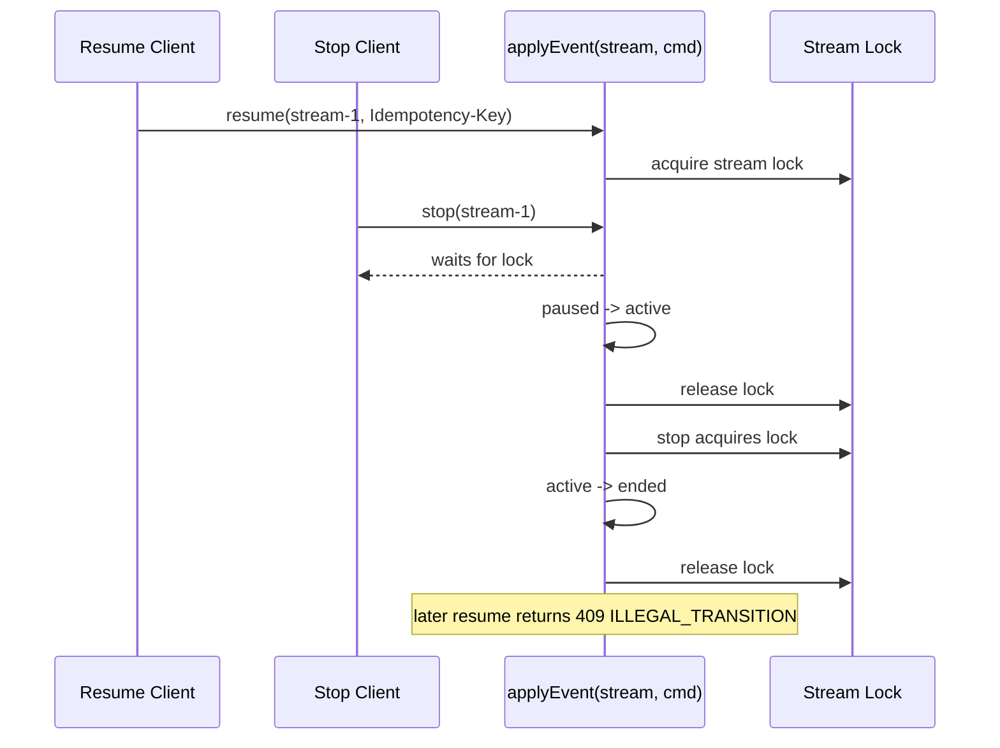

# streampay-frontend

**StreamPay** dashboard — Next.js app for Stellar wallet integration and payment stream management.

## Overview

Next.js 15 (React, TypeScript) frontend for the StreamPay protocol. Users will connect Stellar wallets and create/manage payment streams from this dashboard.

## Prerequisites

- Node.js 18+
- npm (or yarn/pnpm)

## Setup for contributors

1. **Clone and enter the repo**
   ```bash
   git clone <repo-url>
   cd streampay-frontend
   ```

2. **Install dependencies**
   ```bash
   npm install
   ```

3. **Verify setup**
   ```bash
   npm run build
   npm test
   ```

4. **Run locally**
   ```bash
   npm run dev
   ```

App will be at `http://localhost:3000`.

## Scripts

| Command        | Description           |
|----------------|-----------------------|
| `npm run dev`  | Start dev server      |
| `npm run build`| Production build      |
| `npm start`    | Run production build  |
| `npm test`     | Run Jest tests        |
| `npm run lint` | Next.js ESLint        |

## CI/CD

On every push/PR to `main`, GitHub Actions runs:

- Install: `npm ci`
- Build: `npm run build`
- Tests: `npm test`

Ensure the workflow passes before merging.

## Project structure

```
streampay-frontend/
├── app/
│   ├── layout.tsx
│   ├── page.tsx
│   ├── page.test.tsx
│   └── globals.css
├── next.config.ts
├── tsconfig.json
├── jest.config.js
├── jest.setup.ts
├── .github/workflows/ci.yml
└── README.md
```

## Atomic Pause/Resume Semantics

`app/lib/stream-events.ts` provides a single `applyEvent(streamId, cmd)` entry point for stream transitions.

- Lock ordering: always acquire the stream row lock first, then mutate subordinate balances/event state while holding that lock.
- Pause/resume idempotency: `Idempotency-Key` is required by `pauseRoute` and `resumeRoute`.
- Illegal transitions return `409` with `ILLEGAL_TRANSITION`.
- Tenant isolation: cross-tenant pause/resume attempts return `403`.
- Metrics: pause/resume attempts, successes, and failures are tracked in-memory.

### Sequence Diagram: Concurrent Pause + Settle Tick



### Sequence Diagram: Concurrent Resume + Stop



## License

MIT
